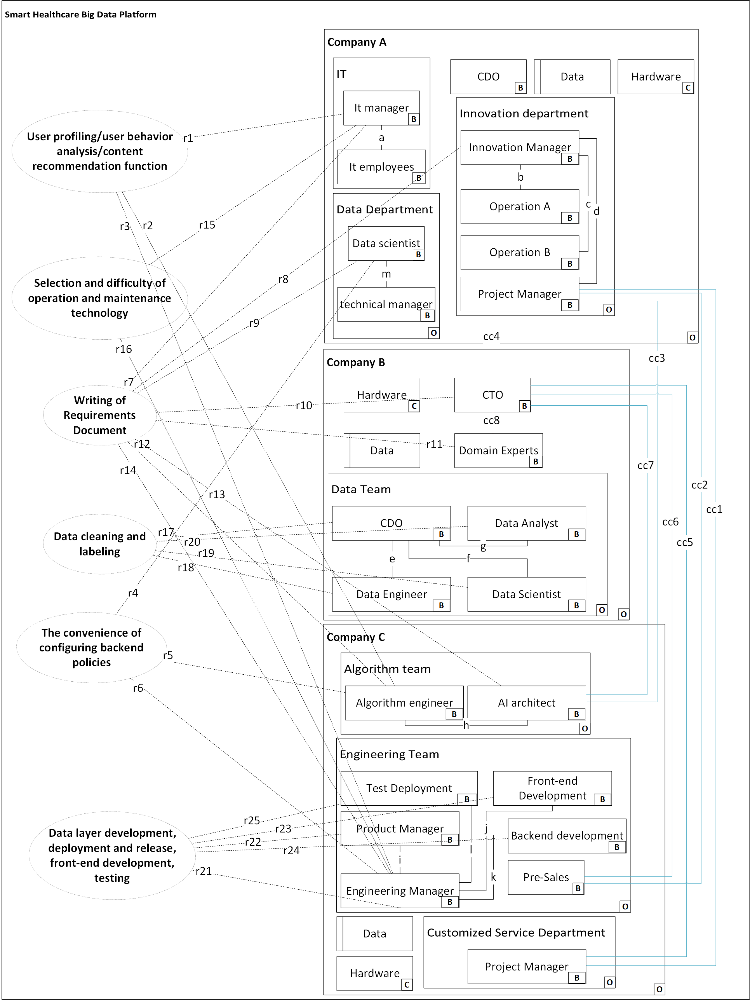

# RDOS

## Project Introduction

This repository contains the materials related to my thesis.

## Organizational Structure Diagrams

* **Actual organizational structure.png** : This diagram illustrates the current actual organizational structure of smart healthcare big data platform project, including the setup of various departments, personnel distribution, and their interrelationships. It provides an intuitive overview of the organization's internal operation mode and departmental collaboration.
* **Ideal Organizational Structure.png** : This diagram presents the ideal organizational structure design based on relevant theories and best practices. It proposes optimized departmental division, management levels, and information flow paths, aiming to serve as a reference and target for organizational structure reform.

## Interview Records

* **Interview minutes.md** : This document records the interview content with smart healthcare big data platform project. It details the views and information gathered during the interview regarding organizational structure, work processes, and personnel collaboration. It provides firsthand empirical data and practical case support for thesis analysis.

## Email Information

- **Email information.md** : This file compiles useful information related to the project extracted from project - related emails, which has been desensitized to ensure privacy and security. It offers supplementary insights and details that aid in understanding the project's progression, communication between stakeholders, and other email - based exchanges relevant to the project.

## Detailed Explanation of Organizational Structure

### Company A (Client-Side)

Company A is structured with several key departments and roles that are integral to the project's execution:

- **CDO (Chief Data Officer)**: The CDO plays a pivotal role, directly interfacing with the Innovation Manager and Data Scientist to oversee the project's progress. The CDO ensures alignment between data strategies and project objectives.
- **Organizational Domain**: Represented by a box with a capital letter "O" at the lower-right corner. It represents departments or units within the organization. An Organizational Domain can be viewed as a company, department, or team, and exists in a hierarchical relationship with other domains. Outer domains can contain inner domains, which can themselves be Organizational Domains or other types of domains, allowing for multi-layer nesting as needed.
- **Data Department**: Responsible for data management, configuring backend policies, and contributing to the writing of requirements documents. The Data Department includes a Data Scientist and a Technical Supervisor, working closely with the Innovation Department to ensure data-driven decision-making.
  - **Data Scientist**: Focuses on data-related tasks.
  - **Technical Supervisor**: Oversees technical aspects and provides guidance.
- **Innovation Department**: This department is comprised of the Innovation Manager, Operation A, Operation B, and the Project Manager. It focuses on user profiling, user behavior analysis, and content recommendation functions, as well as the writing of requirements documents.
  - **Innovation Manager**: As the department head, the Innovation Manager oversees the entire department and serves as a key liaison between Company A and external contractors.
  - **Operation A and Operation B**: These operational staff members execute day-to-day operations and report progress to the Innovation Manager.
  - **Project Manager**: Responsible for coordinating with Company B and Company C, the Project Manager consolidates information and reports to the Innovation Manager.
- **IT Department**:Comprises the IT Manager and IT employees, focusing on the selection and challenges of operation and maintenance technology.
  - **IT Manager**: Oversees the IT department and ensures smooth technical operations.
  - **IT Employees**: Report their progress to the IT Manager, ensuring efficient IT support for the project.
- **Data (Designed Domain)**: Contains the data owned by Company A that is required for the project.
- **Hardware (Causal Domain)**: Contains the physical hardware owned by Company A that is required for the project.

### Company B (Contractor)

Company B specializes in data and requirements analysis, supporting the project through comprehensive data collection and analysis:

- **CTO (Chief Technology Officer)**: Oversees the writing of requirements documents and communicates with multiple departments in Companies A and C to ensure project alignment.
- **Domain Experts**: Focused on the writing of requirements documents, these experts report directly to the CTO, ensuring that project requirements are met.
- **Data Team**: Responsible for data cleaning and labeling, ensuring the quality and usability of data for project decision-making.
  - **CDO**: Oversees the data management strategy and ensures data quality and compliance.
  - **Data Engineers**: Develop and maintain data pipelines and infrastructure.
  - **Data Scientists**: Build and deploy machine learning models to derive insights.
  - **Data Analysts**: Analyze data and generate reports to support project decisions.
- **Data (Designed Domain)**: Contains the data owned by Company B that is required for the project.
- **Hardware (Causal Domain)**: Contains the physical hardware owned by Company B that is required for the project.

### Company C (Contractor)

Company C is instrumental in code development and project management, with a structure designed to support technical and managerial aspects of the project:

- **Customized Service Department**: Includes project managers who oversee project progress and coordinate with Companies A and B to ensure alignment with project timelines and expectations.
  - **Project Manager**: Acts as a key liaison, ensuring that project milestones are met and that communication flows smoothly between companies.
- **Algorithm Team**: Comprises Algorithm Engineers and AI Architects, focusing on backend policy configuration, user profiling, user behavior analysis, content recommendation functions, and contributing to requirements documentation.
  - **Algorithm Engineer**: Develops algorithms critical to the project's technical components.
  - **AI Architect**: Interfaces with Company A's Project Manager to fulfill assigned tasks, ensuring technical alignment.
- **Engineering Team**: A multifaceted group responsible for various aspects of development and deployment.
  - **Pre-sales**: Facilitates communication between Company C and key stakeholders in Companies A and B.
  - **Engineering Manager**: Oversees the Engineering Team, ensuring that front-end and back-end development, testing, and deployment meet project requirements.
  - **Product Manager**: Manages product development and coordinates with other teams.
  - **Front-end and Back-end Development**: Focuses on the technical implementation of the project, ensuring a robust and scalable solution.
  - **Test Deployment**: Ensures the quality and reliability of the developed software through rigorous testing protocols.
- **Data (Designed Domain)**: Contains the data owned by Company C that is required for the project.
- **Hardware (Causal Domain)**: Contains the physical hardware owned by Company C that is required for the project.

## Communication Lines and Their Meanings

In the figure, "mc" followed by a number denotes Missing Communication, "ac" followed by a number represents Abnormal Communication, "cc" followed by a number indicates Correct Communication, and "r" followed by a number stands for requirement references or requirement constraints.

### Missing Communication (mc)

- **Missing Communication Between Company A's Project Manager and Company C's Project Manager(mc1)**
  - **Issue**: The Project Manager in Company A, who acts as a critical liaison between Company A and external contractors, did not maintain consistent communication with the Project Manager in Company C. This resulted in misaligned expectations and requirements, particularly in the writing of the requirements document. The requirements document prepared by Company B did not fully meet the needs of Company C's algorithm development team.
  - **Impact**: The misalignment in requirements led to frequent revisions and additional development cycles, further extending the project timeline.
- **Missing Communication Between Company B's CTO and Company C's Project Manager(mc2)**
  - **Issue**: The CTO of Company B, responsible for overseeing data policies and requirements documentation, did not maintain regular communication with the Project Manager of Company C. This Missing communication led to misalignments in data cleaning and algorithm development. Specifically, the data cleaning processes undertaken by Company B did not align with the algorithmic requirements of Company C, resulting in rework and extended timelines.
  - **Impact**: The algorithms developed by Company C's Algorithm Team could not effectively utilize the cleaned data from Company B, leading to inefficiencies and delays in the project.

