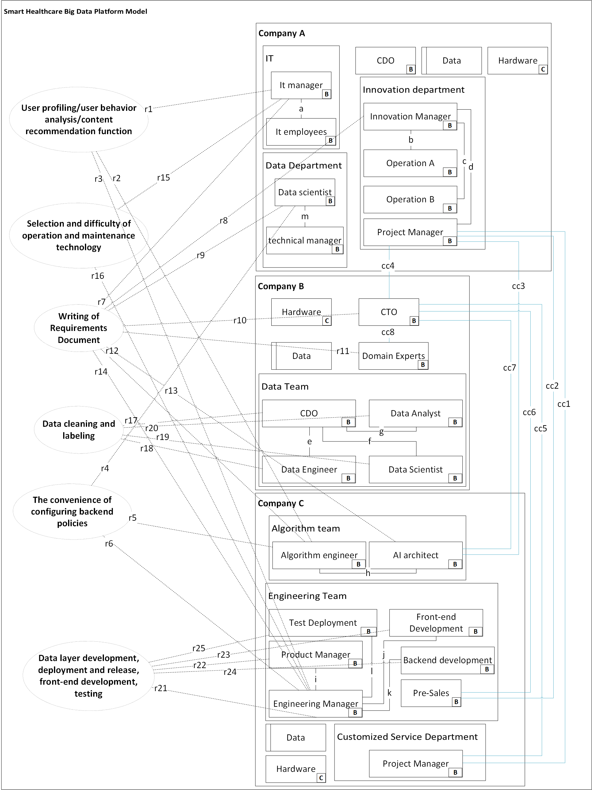

# RDOS

## Project Introduction

This repository contains the materials related to my thesis.

## Organizational Structure Diagrams

* **Actual organizational structure.png** : This diagram illustrates the current actual organizational structure of smart healthcare big data platform project, including the setup of various departments, personnel distribution, and their interrelationships. It provides an intuitive overview of the organization's internal operation mode and departmental collaboration.
* **Ideal Organizational Structure.png** : This diagram presents the ideal organizational structure design based on relevant theories and best practices. It proposes optimized departmental division, management levels, and information flow paths, aiming to serve as a reference and target for organizational structure reform.

## Interview Records

* **Interview minutes.md** : This document records the interview content with smart healthcare big data platform project. It details the views and information gathered during the interview regarding organizational structure, work processes, and personnel collaboration. It provides firsthand empirical data and practical case support for thesis analysis.

